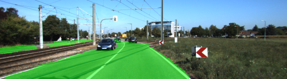
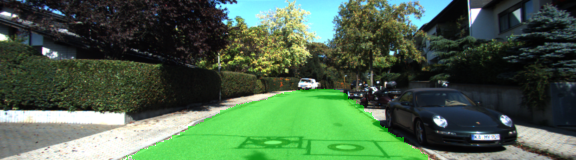
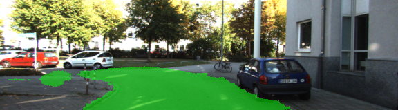

## FCN-8s implementation in TensorFlow

### Contents

1. [Overview](#overview)
2. [Examples](#examples)
3. [Dependencies](#dependencies)
4. [How to use it](#how-to-use-it)
5. [ToDo](#todo)
6. [Terminology](#terminology)

### Overview

This is a TensorFlow implementation of the FCN-8s model architecture for semantic image segmentation introduced by Shelhamer et al. in the paper [Fully Convolutional Networks for Semantic Segmentation](https://arxiv.org/abs/1605.06211).

This repository only contains the 'all-at-once' version of the FCN-8s model, which converges significantly faster than the version trained in stages. A convolutionalized VGG-16 model trained on ImageNet classification is provided and serves as the encoder of the FCN-8s. Sufficient documentation and a tutorial on how to train, evaluate and use the model for prediction is also provided. Some useful TensorBoard summaries can be recorded out of the box.

### Examples

Below are some prediction examples of the model trained on the [KITTI Vision Road/Lane Detection Evaluation 2013 dataset](http://www.cvlibs.net/datasets/kitti/eval_road.php) for 1200 steps, at which point the model reaches a mean IoU of 64% and an accuracy of 79% on the training dataset. The purpose of these examples is just to illustrate that the code works and the model learns.

| |
|---|
|  |
|  |
|  |
|  |

### Dependencies

* Python 3.x
* TensorFlow 1.x
* Numpy
* Scipy
* OpenCV (for data augmentation)
* tqdm
