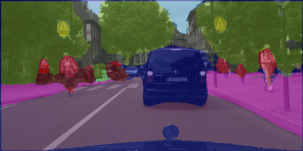
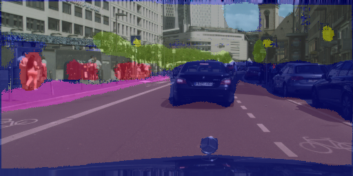
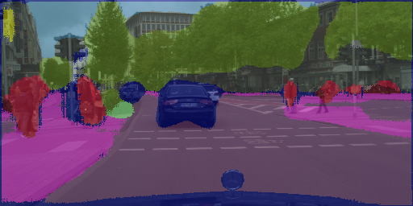

## FCN-8s implementation in TensorFlow
### Contents

1. [Overview](#overview)
2. [Examples and demo video](#examples-and-demo-video)
3. [Dependencies](#dependencies)
4. [How to use it](#how-to-use-it)
5. [Download pre-trained VGG-16](#download-pre-trained-vgg-16)

### Overview

This is a TensorFlow implementation of the FCN-8s model architecture for semantic image segmentation introduced by Shelhamer et al. in the paper [Fully Convolutional Networks for Semantic Segmentation](https://arxiv.org/abs/1605.06211).

This repository only contains the 'all-at-once' version of the FCN-8s model, which converges significantly faster than the version trained in stages. A convolutionalized VGG-16 model trained on ImageNet classification is provided and serves as the encoder of the FCN-8s. Sufficient documentation and a tutorial on how to train, evaluate and use the model for prediction are also provided. Some useful TensorBoard summaries can be recorded out of the box.

### Examples and demo video

Below are some prediction examples of the model trained on the [Cityscapes dataset](https://www.cityscapes-dataset.com/) for 13,000 steps at batch size 16, at which point the model achieves a mean IoU of 38.2% on the validation dataset. This is far from convergence of course, the purpose of these examples is just to demonstrate that the code works and the model learns. You can watch the model in action on the Cityscapes demo videos [here](https://www.youtube.com/watch?v=bSvnMNN_8O8).

### Dependencies

* Python 3.x
* TensorFlow 1.x
* Numpy
* Scipy
* OpenCV (for data augmentation)
* tqdm
* moviepy

### How to use it

[fcn8s_tutorial.ipynb](https://github.com/pierluigiferrari/fcn8s_tensorflow/blob/master/fcn8s_tutorial.ipynb) explains how to train and evaluate the model and how to make and visualize predictions.

### Download pre-trained VGG-16

You can download the pre-trained, convolutionalized VGG-16 model [here](https://drive.google.com/open?id=0B0WbA4IemlxlWlpBd2NBeFUteEE)
